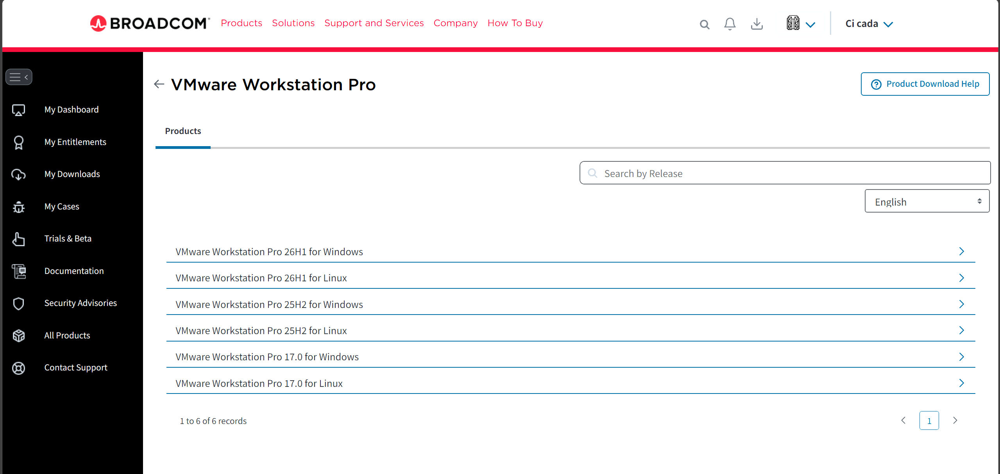

# 开发环境配置

## 1.安装[Ubuntu](https://cn.ubuntu.com/download)的Linux安装包
这里建议使用国内的镜像源进行下载，速度比较块

## 2.安装VMware虚拟机用于加载Linux环境
这一步真的很麻烦，如果想快一点建议直接去充个网盘会员然后下载。  
首先我们得前往[Vmware](https://www.vmware.com/products/desktop-hypervisor/workstation-and-fusion)官网进行下载，然后它会给你跳转到[BROADCOM](https://support.broadcom.com)，注意这里是最麻烦的，首先你得在奇慢无比的网速下注册一个账号，我用qq邮箱还不行，最后换了微软的邮箱。接着登录完就去搜索产品信息VMware Workstation Pro 26H1u1，你得先阅读条款，然后同意下载后，还要验证你的地区，输入城市、邮编之类的，简直荒谬。


## 3.基础命令
首先我们打开Linux系统的终端，输入vi

```js
cicada@cicada-VMware-Virtual-Platform:~$ vi
```
就会跳转到该界面
！[vi命令]
我们也可以通过vi/vim进入某个文件，如果文件不存在就创建这个文件。
```js
cicada@cicada-VMware-Virtual-Platform:~$ vi hello.txt
```
这样我们在命令模式下（command mode），可以通过i/I（insert）、a/A（append）、o/O（open）来进入插入模式（insert mode）  
我使用的Linux系统的终端并没有将vim升级，导致我无法判断当前处于哪个模式，所以我执行以下命令进行升级。
```js
sudo apt update
sudo apt install vim
```

| Syntax | Description |
| :--- | :---- |
| h 或 向左箭头键(←) | 光标向左移动一个字符 |
| j 或 向下箭头键(↓) | 光标向下移动一个字符 |
| k 或 向上箭头键(↑) | 光标向上移动一个字符 |
| l 或 向右箭头键(→) | 光标向右移动一个字符 |
| [Ctrl] + [f] | 屏幕『向下』移动一页，相当于 [Page Down]按键 (常用) |
| [Ctrl] + [b] | 屏幕『向上』移动一页，相当于 [Page Up] 按键 (常用) |
| [Ctrl] + [d] | 屏幕『向下』移动半页 |
| [Ctrl] + [u] | 屏幕『向上』移动半页 |
| + | 光标移动到非空格符的下一行 |
| - | 光标移动到非空格符的上一行 |
| n&lt;space&gt; | 那个 n 表示『数字』，例如 20 。按下数字后再按空格键，光标会向右移动这一行的 n 个字符。例如 20&lt;space&gt; 则光标会向后面移动 20 个字符距离。 |
| 0 或功能键[Home] | 这是数字『 0 』：移动到这一行的最前面字符处 (常用) |
| $ 或功能键[End] | 移动到这一行的最后面字符处(常用) |
| H | 光标移动到这个屏幕的最上方那一行的第一个字符 |
| M | 光标移动到这个屏幕的中央那一行的第一个字符 |
| L | 光标移动到这个屏幕的最下方那一行的第一个字符 |
| G | 移动到这个档案的最后一行(常用) |
| nG | n 为数字。移动到这个档案的第 n 行。例如 20G 则会移动到这个档案的第 20 行(可配合 :set nu) |
| gg | 移动到这个档案的第一行，相当于 1G 啊！ (常用) |
| n&lt;Enter&gt; | n 为数字。光标向下移动 n 行(常用) |

